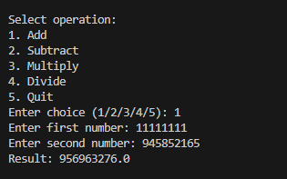
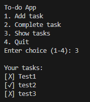

# hello-world
My first GitHub project

# Week 1–2 Python Portfolio

This portfolio contains three mini Python projects to demonstrate foundational programming skills:

## Projects

### 1. Day3.py — Variables & Conditional
- Concepts: variables, data types, boolean, if/else statements
- Description: Accepts user input (name & age) and outputs whether the user is an adult or minor.
- Screenshot:
  

### 2. Calculator.py — CLI Calculator
- Concepts: functions, loops, conditional statements
- Description: A command-line calculator supporting addition, subtraction, multiplication, division.
- Screenshot:
  

### 3. Todo.py — To-do CLI App
- Concepts: functions, classes (OOP), loops, conditional statements
- Description: Manage tasks: add, complete, list. Demonstrates object-oriented programming.
- Screenshot:
  

## How to run
- Open terminal in this folder
- Run project:
  ```bash
  python day3.py
  python calculator.py
  python todo.py